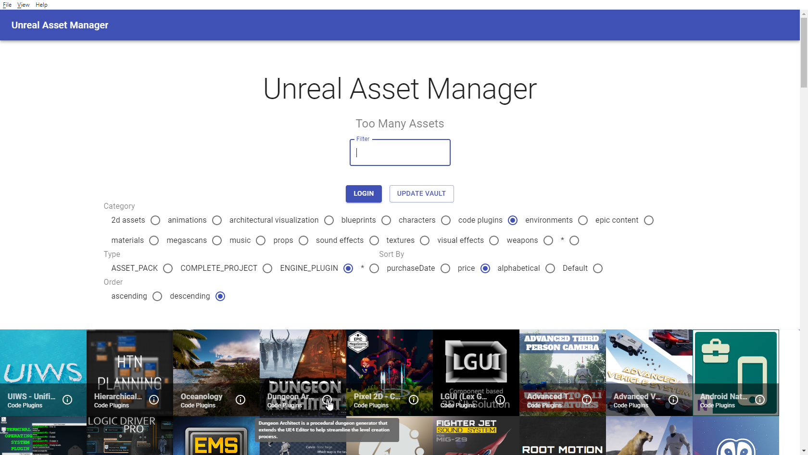
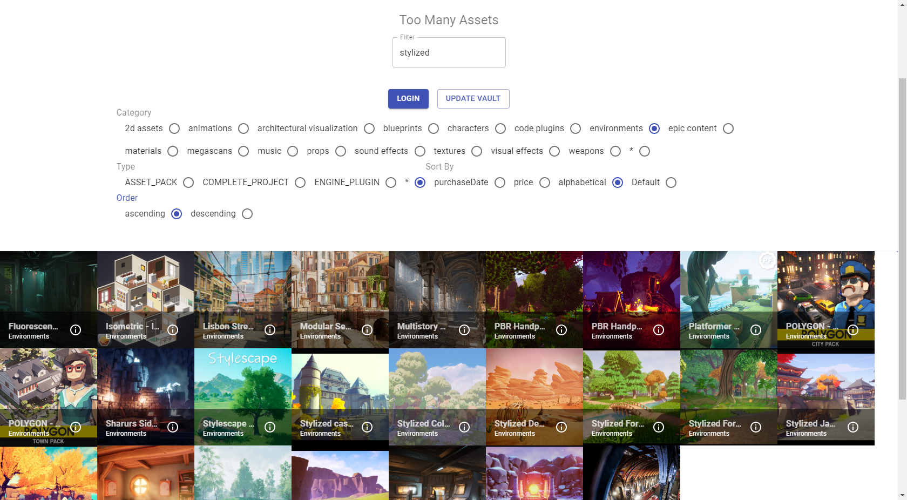

# Unreal Asset Manager

Unreal Asset Manager is an asset manager for Unreal Engine Marketplace that can help you filter, sort and browse assets that you owned. It aims to solve the performance issue with the official launcher with too many assets, and help you quickly find the asset you need.

Note that it is meant to be used alongside with the official launcher, and it is not a replacement of the official launcher.
  
Based on [nmrugg/UE4Launcher](https://github.com/nmrugg/UE4Launcher) and [Electron React Boilerplate](https://github.com/electron-react-boilerplate/electron-react-boilerplate)

## Preview

<br>

<hr />


<div align="center">

[![Build Status][github-actions-status]](github-actions-status)
[![Dependency Status][david-image]][david-url]
[![DevDependency Status][david-dev-image]][david-dev-url]
[![Github Tag][github-tag-image]][github-tag-url]


</div>


## Starting Development

Start the app in the `dev` environment. This starts the renderer process in [**hot-module-replacement**](https://webpack.js.org/guides/hmr-react/) mode and starts a webpack dev server that sends hot updates to the renderer process:

```bash
yarn dev
```

## Packaging for Production

To package apps for the local platform:

```bash
yarn package
```


## License

MIT

[github-actions-status]: https://github.com/Energy0124/UnrealEngineAssetManager/workflows/Test/badge.svg
[github-tag-image]: https://img.shields.io/github/tag/Energy0124/UnrealEngineAssetManager.svg?label=version
[github-tag-url]: https://github.com/Energy0124/UnrealEngineAssetManager/releases/latest
[david-image]: https://img.shields.io/david/Energy0124/UnrealEngineAssetManager.svg
[david-url]: https://david-dm.org/Energy0124/UnrealEngineAssetManager
[david-dev-image]: https://img.shields.io/david/dev/Energy0124/UnrealEngineAssetManager.svg?label=devDependencies
[david-dev-url]: https://david-dm.org/Energy0124/UnrealEngineAssetManager?type=dev
